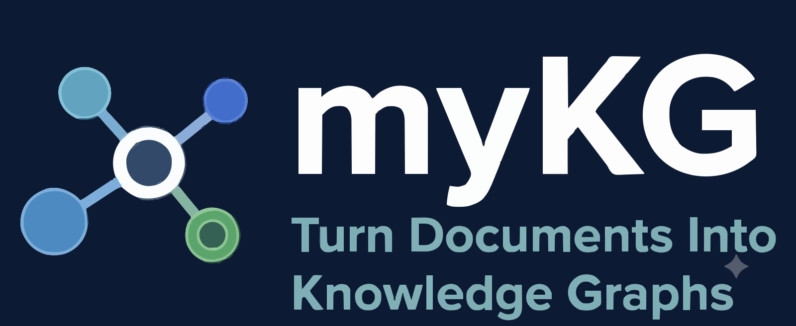

<p align="center">
  
</p>

# Turn your documents into a knowledge graph

**myKG** automatically generates a confidence-scored knowledge graph from a set of mixed documents — Markdown, plain text, PDF, Word, PowerPoint, Excel, HTML, and images — grounded in an induced RDFS/OWL ontology.

It runs as a two-pass LLM pipeline: **Pass 1** induces a global schema (concept types and relationship properties) from your document corpus; **Pass 2** extracts typed entities and relationships per file against that schema. Every attribute, node, and edge carries a confidence score, so you always know how much to trust what was extracted.

[View on GitHub](https://github.com/SenolIsci/mykg) · [PyPI](https://pypi.org/project/mykg/) · [Blog]({{ '/blog.html' | relative_url }})

## Why myKG

- **Schema-guided extraction** — the graph is always grounded in a formal, inspectable RDFS/OWL schema before any entity is extracted, not a black box
- **Bring your own ontology** — lock in classes and properties from an existing formal ontology and let the LLM extend it, or freeze it entirely
- **Five output formats** — JSONL for Neo4j/NetworkX/RAG, Turtle RDF for OWL toolchains, NetworkX multi-format exports, an Obsidian vault of wikilinked notes, and a Neo4j LOAD CSV bundle
- **Second brain for AI coding assistants** — point Claude Code, Cursor, or Copilot at the generated Obsidian vault (or the MCP server) and get answers grounded in your own documents
- **Resumable, incremental, provider-agnostic** — every stage persists intermediate state; append new documents without re-processing everything; works with Anthropic, OpenAI, Ollama, OpenRouter, or the `claude` CLI

## Quick start

```bash
pip install mykg
mykg init
mykg extract-graph my_notes/
```

Open `mykg_sessions/<timestamp>/output/knowledge_graph.html` in your browser to explore the result.

See the [README](https://github.com/SenolIsci/mykg#readme) for the full command reference, configuration options, and pipeline internals.

## Learn more

Read walkthroughs and case studies on the [blog]({{ '/blog.html' | relative_url }}), or dig into the [source on GitHub](https://github.com/SenolIsci/mykg).
